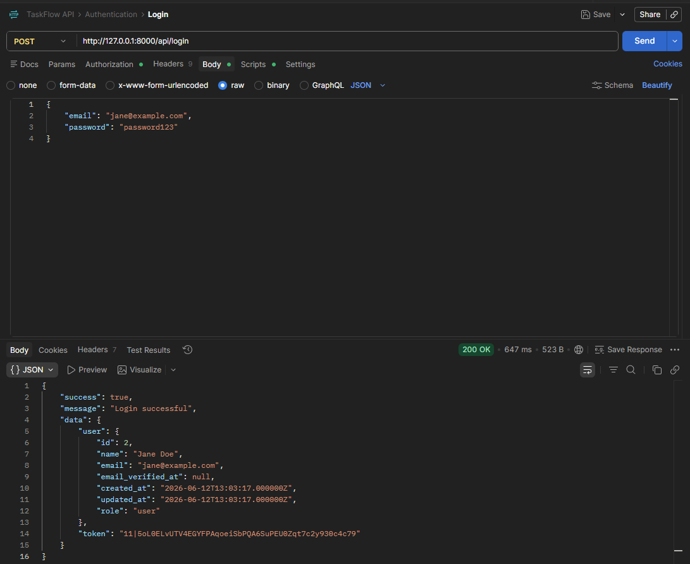
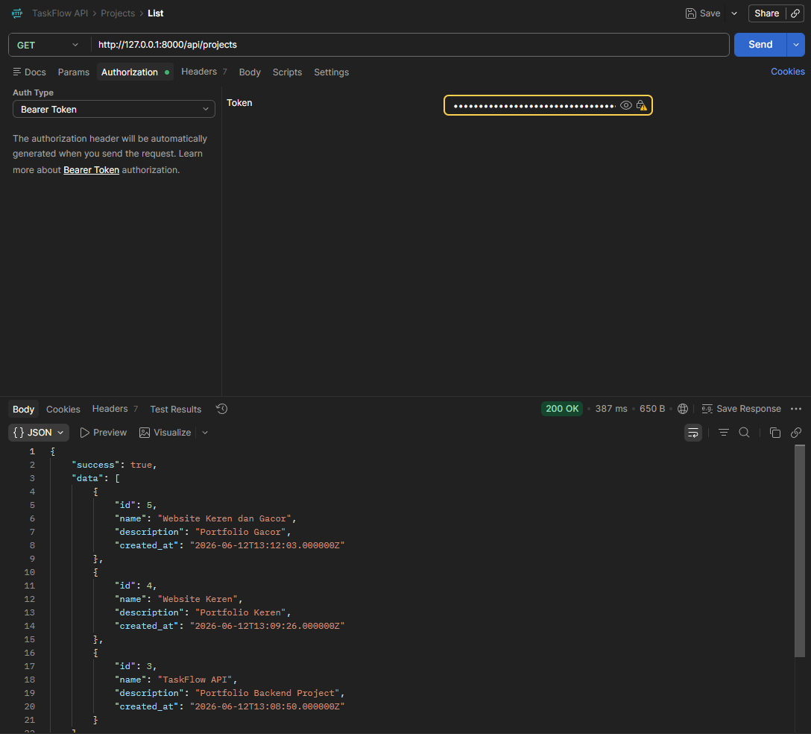
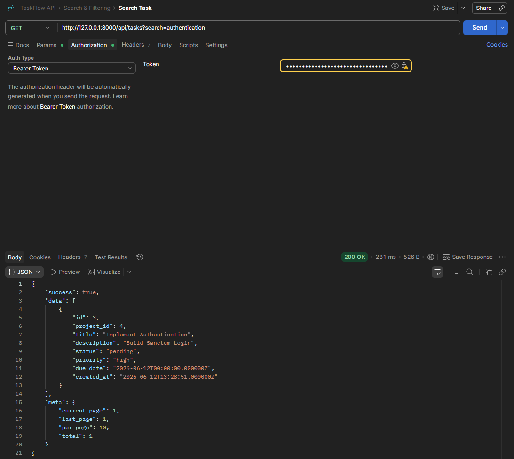
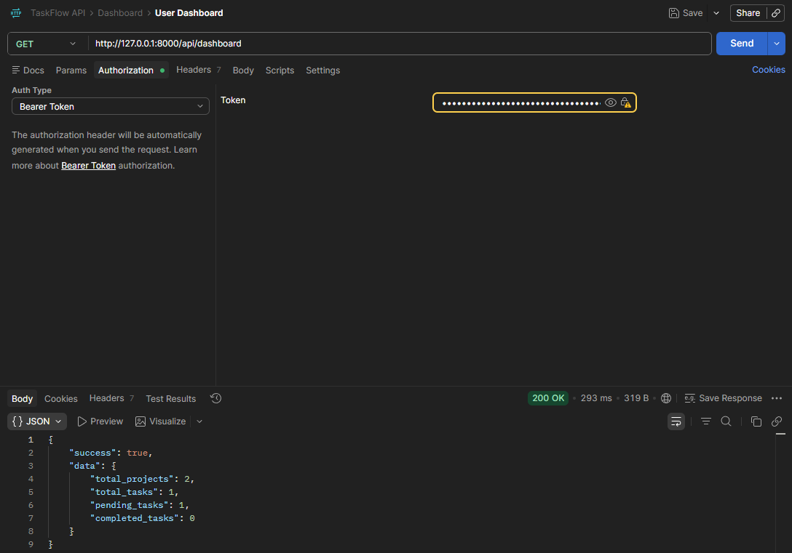
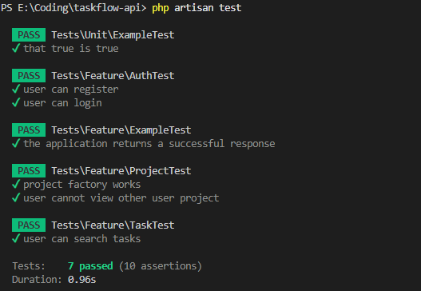

# TaskFlow API

A RESTful API built with Laravel 13 and MySQL for managing projects and tasks.

## Highlights
✓ Token Authentication
✓ Project & Task Management
✓ Search & Filtering
✓ Dashboard Statistics
✓ Automated Tests

## Features

### Authentication

* User Registration
* User Login
* User Logout
* Token Authentication with Laravel Sanctum

### Project Management

* Create Project
* View Projects
* Update Project
* Delete Project

### Task Management

* Create Task
* View Tasks
* Update Task
* Delete Task
* Search Tasks
* Filter Tasks by Status
* Filter Tasks by Priority
* Sort Tasks
* Pagination

### Dashboard

* Total Projects
* Total Tasks
* Pending Tasks
* Completed Tasks

### Security

* Laravel Sanctum Authentication
* Authorization Policies
* Request Validation
* Protected API Routes

### Testing

* Authentication Tests
* Authorization Tests
* Task Search Tests

## Tech Stack

* Laravel 13
* PHP 8.3
* MySQL
* Laravel Sanctum
* PHPUnit
* Postman

## Installation

```bash
git clone <repository-url>

cd taskflow-api

composer install

cp .env.example .env

php artisan key:generate

php artisan migrate

php artisan serve
```

## Run Tests

```bash
php artisan test
```

## API Endpoints

### Authentication

POST /api/register

POST /api/login

POST /api/logout

GET /api/me

### Projects

GET /api/projects

POST /api/projects

GET /api/projects/{id}

PUT /api/projects/{id}

DELETE /api/projects/{id}

### Tasks

GET /api/tasks

POST /api/tasks

GET /api/tasks/{id}

PUT /api/tasks/{id}

DELETE /api/tasks/{id}

### Dashboard

GET /api/dashboard

## Screenshots

### Authentication



### Projects



### Task Search



### Dashboard



### Automated Tests

